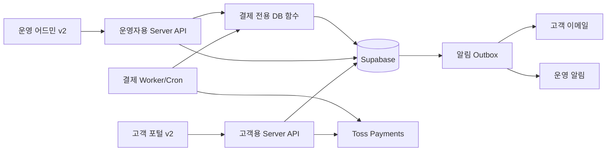

# Replo 고객 포털·운영 어드민 v2 통합 실행안

작성일: 2026-09-15  
상태: 의사결정 초안  
대상: 고객 포털, 운영 어드민, 자동결제, Supabase, GitHub, Vercel

## 1. 결론

**GitHub·Supabase·Vercel을 모두 새로 만들어 한 번에 옮기는 방식은 권장하지 않습니다.** 특히 운영 Supabase를 새로 만들면 Auth 사용자, Workspace, 운영 데이터, 결제 동의, 암호화된 빌링키, Invoice와 감사 이력을 함께 옮겨야 합니다. 이 과정은 중복 청구, 사용자 ID 불일치, 고객사 연결 누락 위험이 큽니다.

권장안은 다음과 같은 **단계적 v2 분리**입니다.

1. 운영 Supabase는 당분간 하나의 source of truth로 유지합니다.
2. 개발·QA용 Supabase 환경은 운영과 분리해 새로 만듭니다.
3. v2 코드는 private GitHub monorepo로 정리하는 방안을 우선 검토합니다.
4. 고객 포털과 운영 어드민은 별도 Vercel Project로 배포하되 같은 데이터 계약을 사용합니다.
5. 운영 어드민은 결제 테이블을 직접 수정하지 않고 서버 전용 API와 감사 RPC로만 조작합니다.
6. 기존 고객 포털을 유지한 상태에서 어드민 조회 → 운영 조치 → 알림 → 고객 화면 순서로 하나씩 전환합니다.

즉, **새 v2 코드와 새 비운영 환경은 만드는 편이 좋고, 새 운영 결제 DB로 즉시 이전하는 것은 피하는 편이 좋습니다.**

## 2. 현재 확인된 상태

### 확인된 사실

- 고객 홈페이지·마이페이지·대시보드·자동결제 API는 `AvinTEST/replo-homepage` 저장소에 함께 있습니다.
- 해당 저장소는 현재 public이며, 고객 포털과 결제 migration도 같은 저장소에서 관리합니다.
- 자동결제 데이터는 `workspace_id`를 기준으로 현재 운영 데이터와 연결됩니다.
- 결제 구조에는 구독, 요금제 변경, 카드 메타정보, 암호화된 빌링키, 등록 동의, Invoice, Attempt, 취소, 이벤트, 운영자 감사 이력이 포함됩니다.
- 운영 어드민은 `replo-admin-eta.vercel.app`에서 별도 앱으로 동작합니다. 고객사, 브랜드, 계정, 지식, 정책, 변경 이력 등 운영 기능을 이미 보유하고 있습니다.
- 현재 확인 가능한 AvinTEST GitHub에는 운영 중인 어드민과 일치하는 활성 소스 저장소가 없습니다. `Avin_omni_admin`은 내용이 없는 저장소이고, `avin-dashbord`는 오래된 별도 대시보드 저장소입니다.
- 현재 AvinCorporation Vercel Team에서 확인되는 프로젝트 목록에는 `replo-homepage`가 있으나 운영 어드민 프로젝트는 없습니다. 운영 어드민은 다른 Team 또는 계정에서 관리되는 것으로 보입니다.
- 카드 등록 수정본 `579e614`는 Preview 배포까지 완료됐고 운영 승격은 보류 중입니다.

### [확인 필요]

- 운영 어드민의 실제 GitHub 저장소와 기본 브랜치
- 운영 어드민이 사용하는 Supabase Project와 데이터 모델
- 운영 어드민 Vercel Project의 소유 Team, Git 연결, 환경변수 관리 주체
- 운영 어드민의 고객사 ID와 현재 `workspaces.id`가 같은 값인지, 별도 ID인지
- 운영 어드민 로그인 사용자가 Supabase Auth 사용자인지 별도 인증 체계인지
- 현재 운영 Supabase의 migration history와 Git migration 파일의 완전 일치 여부
- 운영 DB 백업/PITR 사용 가능 여부와 복구 담당자

이 일곱 항목을 확인하기 전에는 운영 어드민에 결제 쓰기 기능을 붙이거나 운영 DB를 새 프로젝트로 옮기지 않습니다.

## 3. 목표 구조



### 데이터 원칙

- `workspaces.id`를 고객사 식별자의 기준으로 유지합니다.
- 운영 어드민의 기존 고객사 ID가 다르면 `workspace_external_links` 같은 명시적 매핑 테이블을 둡니다. 고객사 행을 두 DB에서 각각 수정하는 구조는 만들지 않습니다.
- 현재 상태와 이력을 분리합니다. `subscriptions`와 `billing_profiles`는 현재 상태, Invoice·Attempt·Event·Operator Action은 이력입니다.
- 카드번호와 빌링키는 운영 어드민에 노출하지 않습니다. 카드사, 마스킹 번호, 주/백업 상태만 표시합니다.
- `service_role`, Toss Secret Key, 암호화 키는 서버에서만 사용합니다.
- 운영자 조치는 내부 사용자 확인, 사유 입력, DB 트랜잭션, 감사 로그가 모두 성공해야 완료됩니다.

### 코드 원칙

v2를 새 저장소로 만든다면 아래 private monorepo 구성을 권장합니다.

```text
replo-platform-v2/
  apps/
    customer/       고객 홈페이지·마이페이지
    admin/          내부 운영 어드민
  packages/
    billing/        결제 도메인·Toss client·타입
    database/       migration·DB contract·generated types
    auth/           고객 membership·내부 operator 권한
    ui/             공통 디자인 토큰과 기본 컴포넌트
  supabase/
    migrations/
    seed.sql
  docs/
    adr/
    runbooks/
```

초기에는 Worker/Cron을 `apps/customer`에 유지합니다. 거래량과 운영 복잡도가 커진 뒤 별도 앱으로 분리합니다. 현재 Vercel Hobby 환경에서는 여러 프로젝트를 동시에 빌드할 때 대기 시간이 늘 수 있으므로 처음부터 세 개 이상의 배포 단위로 나누지 않습니다.

## 4. 기존 시스템 확장과 전면 v2 비교

| 판단 항목 | 기존 `replo-homepage` 확장 | 전부 새로 구축 | 권장 하이브리드 v2 |
| --- | --- | --- | --- |
| 출시 속도 | 빠름 | 느림 | 중간 |
| 운영 데이터 이전 | 없음 | 전체 필요 | 없음 또는 최소 |
| 결제 사고 위험 | 낮음 | 높음 | 낮음 |
| 고객/어드민 코드 분리 | 약함 | 좋음 | 좋음 |
| 어드민 소스 불명 문제 | 해결 안 됨 | 새로 구현 필요 | 먼저 회수 후 선택 |
| 개발 DB 격리 | 별도 작업 필요 | 가능 | 필수로 구성 |
| 롤백 | 쉬움 | 어려움 | 기능별 롤백 가능 |
| 장기 유지보수 | 결합 증가 | 좋을 수 있으나 초기 비용 큼 | 가장 균형적 |

### 결정

- **새 GitHub:** 권장. 단, 운영 어드민 소스를 먼저 회수하고 두 앱의 공통 도메인을 확정한 뒤 private monorepo로 만듭니다. 기존 Git 이력을 보존해 import합니다.
- **새 Vercel:** 고객 v2와 어드민 v2를 같은 AvinCorporation Team의 별도 Project로 두는 것을 권장합니다. 계정/Team 자체를 새로 만들 필요는 없습니다.
- **새 Supabase 개발·QA:** 필수에 가깝습니다. 운영 데이터 없이 schema와 seed만 적용합니다.
- **새 Supabase 운영:** 현재는 비권장입니다. 데이터 소유권과 migration history가 정리되고 실제 이전 필요성이 확인될 때 별도 프로젝트로 검토합니다.

## 5. 운영 어드민에 추가할 결제 기능

### 1단계: 조회 전용

고객사 상세에 `결제` 탭을 추가합니다.

- 현재 요금제, 월 기본 이용료, VAT, 포함 상담량
- 다음 달 적용 예정 요금제와 동의 일시
- 자동결제 상태와 중지 사유
- 주 카드·백업 카드의 카드사와 마스킹 번호
- 최근 Invoice, 결제 성공/실패/확인 중 상태, 영수증
- 기술 오류 횟수, 고객 결제 실패 횟수, 다음 처리 예정 시각
- 장기 미확정 결제와 운영자 확인 필요 건
- 고객에게 발송된 알림과 발송 실패

조회는 운영 어드민의 서버 API가 수행합니다. 브라우저가 billing table에 service role로 직접 접근하지 않습니다.

### 2단계: 안전한 운영 조치

- Workspace 자동결제 일시중지·재개
- 10회 기술 오류 차단 건 재검토 후 재개
- 미납 Invoice 한 건 단위 재결제 승인
- 요금제 변경 예약 확인·취소
- 외부 환불 상태 확인
- 결제 장애 담당자 배정과 처리 메모

모든 조치는 `operator_user_id`, 사유, 이전 값, 변경 값, 실행 시각을 남깁니다. 일괄 재결제와 백업 카드 자동 승인은 별도 정책 승인 전 제공하지 않습니다.

### 3단계: 알림과 장애 대응

- 카드 등록 완료 이메일
- 결제 실패와 다음 처리 일정 이메일
- 최종 실패·미납 전환 이메일
- 장기 reconciliation, 승인 후 DB 반영 실패, 고아 빌링키 정리 실패 운영 알림
- 알림 중복 방지를 위한 outbox, 발송 상태, 재시도 횟수, `notified_at`

## 6. DB migration 순서

### Migration 0: 기준선 확정

1. 운영 DB schema dump와 migration history를 확보합니다.
2. Git의 모든 migration을 빈 개발 DB에 순서대로 적용합니다.
3. 운영 schema와 비교해 drift 목록을 만듭니다.
4. 차이를 덮어쓰지 말고 baseline migration 또는 수동 정리 항목으로 분리합니다.
5. RLS, 함수 실행 권한, `PUBLIC` grant, advisor 결과를 확인합니다.

### Migration 1: 어드민 식별자 연결

- 운영 어드민 고객사 ID와 `workspace_id`가 다를 때만 `workspace_external_links`를 추가합니다.
- `source`, `external_id`, `workspace_id`, `linked_at`, `linked_by`를 저장합니다.
- `(source, external_id)`와 `(source, workspace_id)`에 uniqueness를 둡니다.
- 자동 추정 매핑을 만들지 않고 회사명·이메일·브랜드명은 검토 보조 정보로만 사용합니다.

### Migration 2: 내부 운영자 권한

- 고객 `workspace_members`와 별도로 내부 운영자 권한을 정의합니다.
- 권한 예시: `billing_viewer`, `billing_operator`, `billing_admin`.
- 운영자 API는 세션과 내부 역할을 확인한 뒤 서비스 전용 RPC를 호출합니다.
- 고객 membership을 내부 운영 권한 대신 사용하지 않습니다.

### Migration 3: 알림 outbox와 사건 관리

- `billing_notification_outbox`: 이벤트, 수신처, 상태, 시도 횟수, 다음 시도, 발송 결과
- `billing_incidents`: Workspace, Invoice/Attempt, 위험도, 상태, 담당자, 마지막 확인 시각
- 원문 Toss 응답, authKey, billingKey는 저장하지 않습니다.

### Migration 4: 운영자 API/RPC

- 기존 `billing_pause_workspace`, `billing_approve_arrears_retry`, 주 카드 전환 RPC를 재사용합니다.
- 필요한 조회는 server-only query 또는 권한이 제한된 함수로 제공합니다.
- `SECURITY DEFINER` 함수는 실행 권한을 명시적으로 회수·부여하고 함수 내부에서도 운영자 권한을 검증합니다.

## 7. 실제 진행 순서

### Phase A — 소유권과 기준선 회수, 1~2일

- [ ] 운영 어드민 Git 저장소·브랜치·Vercel Team 확인
- [ ] 운영 어드민 환경변수 이름과 연결 Supabase 확인
- [ ] 운영 Supabase backup/PITR와 migration history 확인
- [ ] 고객 포털 `workspace_id`와 어드민 고객사 ID 대조표 생성
- [ ] 운영 배포 권한과 담당자 기록

**완료 기준:** 세 시스템의 코드, 배포, DB 소유자가 문서에 한 줄씩 명확히 기록됩니다.

### Phase B — 개발 환경과 공통 계약, 2~4일

- [ ] 새 개발/QA Supabase 또는 persistent branch 생성
- [ ] migration 전체 적용과 최소 seed 작성
- [ ] 고객 A/B, owner/admin/editor/viewer, 내부 operator 테스트 계정 구성
- [ ] `workspace_id`, plan code, billing status, event type 계약 확정
- [ ] DB generated type와 API response type를 공통 package로 이동
- [ ] ADR: 저장소 구조, 배포 단위, DB 환경, 권한 모델 작성

**완료 기준:** 운영 DB를 쓰지 않고 카드 등록 직전까지와 어드민 결제 조회를 재현할 수 있습니다.

### Phase C — 운영 어드민 조회 연결, 3~5일

- [ ] 고객사 상세 `결제` 탭
- [ ] 결제 위험 목록과 필터
- [ ] 카드 마스킹·Invoice·Attempt·Event 조회
- [ ] 운영 DB 직접 수정을 막는 권한 테스트

**완료 기준:** 담당자가 SQL Editor 없이 결제 중지·미납·불확실 건을 찾을 수 있습니다.

### Phase D — 운영 조치와 감사, 4~7일

- [ ] 일시중지·재개
- [ ] 기술 오류 차단 해제
- [ ] Invoice 한 건 재결제 승인
- [ ] 요금제 예약 확인·취소
- [ ] 사유 필수 입력과 감사 로그
- [ ] 동시 실행·중복 클릭·권한 회수 테스트

**완료 기준:** 모든 금액 관련 변경이 DB 트랜잭션과 감사 이력으로 재현됩니다.

### Phase E — 알림·관측·출시, 3~6일

- [ ] 고객 결제 알림 outbox
- [ ] 운영 장애 알림 목적지
- [ ] 장기 미확정 자동 에스컬레이션
- [ ] Preview E2E, 모바일/데스크톱, 역할별 테스트
- [ ] kill switch와 롤백 훈련
- [ ] 소수 테스트 Workspace부터 단계적 활성화

**완료 기준:** 결제 실패나 결과 불명 상태가 사람에게 도달하고, 운영자가 화면에서 후속 조치를 할 수 있습니다.

## 8. v2 전환 방식

### 권장: strangler 전환

1. 기존 고객 포털과 운영 어드민을 그대로 둡니다.
2. v2 어드민의 결제 조회 화면을 먼저 엽니다.
3. 운영 조치 기능을 한 종류씩 v2로 옮깁니다.
4. 고객 포털은 테스트 Workspace에만 v2 링크를 노출합니다.
5. 읽기 결과를 기존 화면과 비교하고 쓰기는 한 경로에서만 수행합니다.
6. 역할·알림·청구·복구 Gate를 통과하면 기본 경로를 v2로 전환합니다.
7. 기존 경로는 일정 기간 읽기 전용으로 유지한 뒤 제거합니다.

결제에는 dual write를 사용하지 않습니다. 같은 조치를 구 시스템과 v2가 각각 쓰면 중복 승인과 상태 충돌을 만들 수 있습니다.

### 운영 Supabase를 새로 만들어야 하는 경우

아래 조건이 모두 충족될 때만 별도 이전 프로젝트로 진행합니다.

- 현재 schema drift와 migration history를 완전히 설명할 수 있음
- Auth 사용자 ID와 Workspace ID를 보존하는 이행 절차가 검증됨
- 암호화 키와 AAD를 유지해 기존 빌링키 복호화가 검증됨
- Invoice·Attempt·Consent·Audit 전수 대사가 완료됨
- 이전 중 승인 요청을 한 시스템만 낼 수 있는 freeze/cutover 계획이 있음
- 롤백 시 어느 DB가 source of truth인지 결정됨
- Toss Test 환경에서 전체 리허설이 성공함

이 조건이 없다면 새 운영 Supabase는 구조 개선보다 금액 사고 위험을 크게 만듭니다.

## 9. 바로 시작할 작업 목록

| 순서 | 작업 | 산출물 | 선행 조건 |
| --- | --- | --- | --- |
| 1 | 운영 어드민 소스·배포·DB 회수 | `system-inventory.md` | 없음 |
| 2 | 운영 DB와 Git migration drift 확인 | schema diff, migration baseline | DB read 권한 |
| 3 | v2 ADR 작성 | 저장소·Vercel·Supabase 결정문 | 1, 2 |
| 4 | 개발 Supabase 구축 | 개발 URL, migration 결과, seed | 2 |
| 5 | 어드민 고객사↔Workspace 매핑 | 검토 가능한 대조표 | 1, 4 |
| 6 | 어드민 결제 조회 탭 | Preview URL | 3~5 |
| 7 | 운영 조치 RPC 연결 | 권한/감사 테스트 | 6 |
| 8 | 고객·운영 알림 | outbox와 발송 로그 | 7 |
| 9 | 테스트 Workspace 출시 | Gate 결과서 | 4~8 |
| 10 | v2 기본 경로 전환 | cutover/rollback 기록 | 9 |

가장 먼저 할 일은 **새 프로젝트 생성이 아니라 운영 어드민의 실제 원본과 DB 연결을 찾는 것**입니다. 이 작업이 끝나야 새 private monorepo로 옮길지, 현재 어드민 저장소를 정리할지 안전하게 결정할 수 있습니다.

## 10. 출시 Gate

- [ ] 운영 어드민과 고객 포털이 같은 Workspace를 같은 ID로 조회
- [ ] 내부 operator와 고객 owner/admin 권한이 분리됨
- [ ] 브라우저에 service role, Toss Secret, 암호화 키가 노출되지 않음
- [ ] 카드 등록·주/백업 전환·세 번째 카드 차단 검증
- [ ] 요금제 변경 동의와 다음 달 1일 적용 검증
- [ ] 중복 Cron과 중복 클릭에도 승인 1회
- [ ] 승인 성공 후 DB 장애 복구
- [ ] 기술 오류와 고객 결제 실패 카운터 분리
- [ ] 고객 알림과 운영 알림의 중복 방지
- [ ] 운영자 조치 사유와 전후 상태 감사 이력
- [ ] migration 전체 체인을 빈 개발 DB에 적용
- [ ] RLS/함수 권한/advisor 검토
- [ ] kill switch와 rollback 리허설

## 11. 참고 자료

- Supabase는 staging과 production을 분리하고 migration을 CI에서 적용하는 환경 구성을 안내합니다: <https://supabase.com/docs/guides/deployment/managing-environments>
- Supabase Branch는 DB, Auth, Storage, API credential이 분리된 개발·Preview 환경을 만들 수 있으며 기본적으로 운영 데이터는 복사하지 않습니다: <https://supabase.com/docs/guides/deployment/branching>
- Vercel은 하나의 monorepo 안 각 디렉터리를 별도 Project로 배포할 수 있습니다: <https://vercel.com/docs/monorepos>
