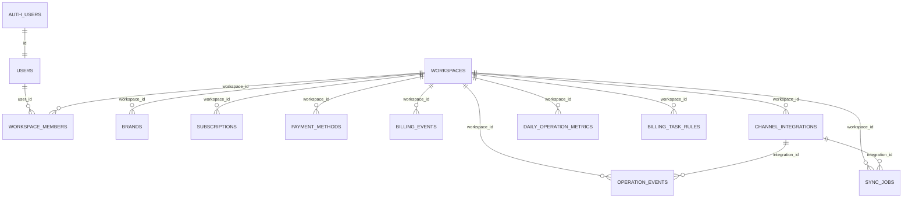

# Workspace Tenancy Migration

Unifies the duplicated tenancy model onto a single `workspace_id` key, replaces
`profiles` with `public.users`, and renames the tenancy entity from "customer" to
the more intuitive "workspace".

## Naming decision

`user` is a person; the tenancy/account/contract entity is a **workspace** (a
company whose staff are members via `workspace_members`). The word "customer"
previously meant three different things in this codebase, and only the first is
renamed:

1. **The tenancy entity** (`customers` / `customer_members` / `customer_id`) →
   renamed to `workspaces` / `workspace_members` / `workspace_id`.
2. **The end-consumer** who contacted support
   (`operation_events.customer_external_id`, `NormalizedOperationEvent.customerExternalId`,
   ChannelTalk `chat.userId`, Coupang "Customer Inquiry") → **kept** as "customer".
3. **The external Airtable "Customers" table** (`AIRTABLE_CUSTOMERS_TABLE_ID`,
   `AIRTABLE_CUSTOMERS_FIELD_MAP`, `mapCustomerToAirtableFields`) → **kept**, since
   the Airtable destination table is still named "Customers".

`workspace` was chosen over `account`/`company`/`organization` because the UI
already says "워크스페이스" and the workspace-bootstrap RPC was already named
`initialize_customer_workspace`.

## Current Duplication Report

Legacy tenancy (`tenants`, `tenant_users`, `tenant_id`) duplicated the workspace
tenancy (`customers`/`customer_members`/`customer_id`). `20260613152359_unify_customer_tenancy.sql`
kept both alive instead of choosing one key. Overlaps:

- `tenants` ↔ `workspaces`: company/account unit. `company_name`/`display_name` →
  `workspaces.company_name` (+ `brands.name` for display); `timezone` →
  `workspaces.timezone`; `plan_name`/`monthly_plan_limit` are subscription
  attributes → `subscriptions.plan_name`/`subscriptions.included_tickets`.
- `tenant_users` ↔ `workspace_members`: user↔account role map.
  `tenant_users.manager` → `workspace_members.editor` (manager had write access but
  was not an owner/admin billing/member-management role).
- `profiles` ↔ new `public.users`: service-user profile. `public.users.id` =
  `auth.users.id`; `profiles.user_id` becomes `users.id`.
- `channel_integrations` had both `tenant_id` and `customer_id`; canonical key is
  `workspace_id`, `tenant_id` is dropped after verification.
- `operation_events`, `daily_operation_metrics`, `sync_jobs`, `billing_task_rules`
  were modeled on `tenant_id`; they gain `workspace_id`, backfilled then promoted.

## Target ERD

## Migration SQL (three ordered, unapplied migrations)

1. `supabase/migrations/202606180000_rename_customer_entity_to_workspace.sql`
   - Drops the abandoned `customer_members → tenant_users` bridge trigger/function.
   - Renames `customers`→`workspaces`, `customer_members`→`workspace_members`, and
     `customer_id`→`workspace_id` on the 9 workspace-native tables.
   - Repoints the pre-existing helper `private.customer_role` and the
     `enforce_channel_talk_limit` trigger at the renamed objects (function bodies do
     not auto-update on `ALTER ... RENAME`), so the next migration's backfill works.
2. `supabase/migrations/202606180001_customer_id_canonical_model.sql`
   - Creates `public.users`, backfills from `profiles` + `auth.users`.
   - Adds `workspaces.timezone`; adds `subscriptions.included_tickets` +
     `subscriptions.updated_at`; moves tenant plan fields into `subscriptions`.
   - Backfills `workspace_members` from `tenant_users`.
   - Adds + backfills `workspace_id` on the operational tables; new indexes and
     uniqueness.
   - Replaces RLS helpers with `private.workspace_role/is_workspace_member/
     can_read_workspace/can_edit_workspace_data/can_manage_workspace`; drops the old
     customer-named helpers and every legacy policy; installs workspace policies.
   - Replaces `initialize_customer_workspace` with `public.initialize_workspace`
     returning `(workspace_id, brand_id)`.
3. `supabase/migrations/202606180002_drop_legacy_tenant_profile_model.sql`
   - Guarded cleanup: aborts if any `workspace_id` is null or `profiles`/
     `tenant_users` are unbackfilled; drops `tenant_id` columns, `tenants`,
     `tenant_users`, `profiles`; sets `workspace_id` NOT NULL.

Note: index/constraint names keep their original `customers_*`/`tenant_*` spelling
because `ALTER ... RENAME` does not rename dependent indexes/constraints; the
cleanup migration drops them by their original names.

## RLS Model

All policies call `private.*workspace*` `security definer` helpers that match
`auth.uid()` against `workspace_members.user_id` (status='active').

- `viewer`: read workspace-scoped data only.
- `editor`: read + write operational/integration/brand/rule data.
- `admin`: editor + workspace/member/subscription/payment management.
- `owner`: highest business role (admin privileges).

`channel_integrations` holds encrypted credentials, so direct `authenticated`
grants stay revoked; server routes check `workspace_members` then use
`service_role`.

## Affected Code Files

- `src/lib/workspaces/access.ts` (was `src/lib/customers/access.ts`) — exports
  `WorkspaceAccess`, `WorkspaceRole`, `getCurrentWorkspaceAccess`,
  `canManageWorkspace`; the access object's entity property is now `.workspace`.
- `src/lib/integrations/workspaceIntegrations.ts` (was `customerIntegrations.ts`).
- `src/lib/tenants/auth.ts`, `src/lib/dashboard/service.ts`,
  `src/lib/dashboard/metrics.ts`, `src/lib/integrations/service.ts`,
  `src/lib/integrations/syncTargets.ts`, `src/lib/integrations/syncChannelTalk.ts`.
- `src/app/api/onboarding/route.ts` (RPC `initialize_workspace`),
  `src/app/api/members/*`, `src/app/api/integrations/*`, `src/app/api/mypage/*`,
  `src/app/api/cron/sync/route.ts`, `src/app/api/tenants/[tenantId]/*`,
  `src/app/auth/callback/route.ts`, dashboard/mypage pages and components.
- `src/app/api/integrations/airtable/customers/route.ts` — the webhook discriminator
  now matches `table: "workspaces"`; Airtable-facing names are intentionally kept.

Deferred compatibility debt (route/prop naming only): `/api/tenants/[tenantId]`,
`/dashboard/[tenantId]`, `/api/mypage/customer`, `getTenantAccess`/`TenantAccess`,
and the `tenant:` param key in `buildDashboardFromMetricFixtures`. These are not DB
references and can be renamed later with redirects.

## Manual Risks

- **Airtable DB webhook**: the external Supabase Database Webhook fires on the
  renamed table. Confirm in the Supabase dashboard that it still fires and reports
  `table: "workspaces"` after the rename; otherwise re-point it.
- Production data may have ambiguous `customers.tenant_id` mappings from the earlier
  dual-model migration.
- `channel_integrations` rows without a resolvable `workspace_id`/`tenant_id`, and
  operational rows with null `integration_id`, need manual mapping.
- External SQL/Airtable/exports/Supabase policies outside this repo may still
  reference `profiles`, `tenants`, `tenant_users`, `customers`, `customer_members`,
  or `*_id` columns.
- The cleanup migration intentionally fails if null `workspace_id` rows or
  unbackfilled `profiles`/`tenant_users` rows remain.
- Audit-log string literals (`target_type: "customer"`, `action:
  "customer.profile_updated"`) were left as-is to preserve historical event
  taxonomy; new `initialize_workspace` writes `target_type: "workspace"`.

## Dev Verification Scenarios

1. Apply 180000–180002 to dev in order.
2. `public.users` count ≥ distinct `profiles.user_id` count.
3. Every active `tenant_users` row with a mapped workspace has a matching
   `workspace_members` row.
4. Before cleanup these all return zero:
   - `select count(*) from channel_integrations where workspace_id is null;`
   - `select count(*) from operation_events where workspace_id is null;`
   - `select count(*) from daily_operation_metrics where workspace_id is null;`
   - `select count(*) from sync_jobs where workspace_id is null;`
   - `select count(*) from billing_task_rules where workspace_id is null;`
5. Sign in as owner/admin/editor/viewer; verify read/write boundaries.
6. Onboard a workspace; verify only `workspaces`, `users`, `workspace_members`,
   `brands`, `subscriptions` are written and the RPC returns `(workspace_id, brand_id)`.
7. Add a ChannelTalk integration; verify `channel_integrations.workspace_id` is set
   and the 10-integration limit trigger still works.
8. Run `/api/cron/sync`; verify `operation_events`/`daily_operation_metrics`/
   `sync_jobs` write `workspace_id`.
9. Insert a workspace row; verify the Airtable webhook still mirrors it.
10. `npm run test:dashboard` and `npx tsc --noEmit` (both currently green).
